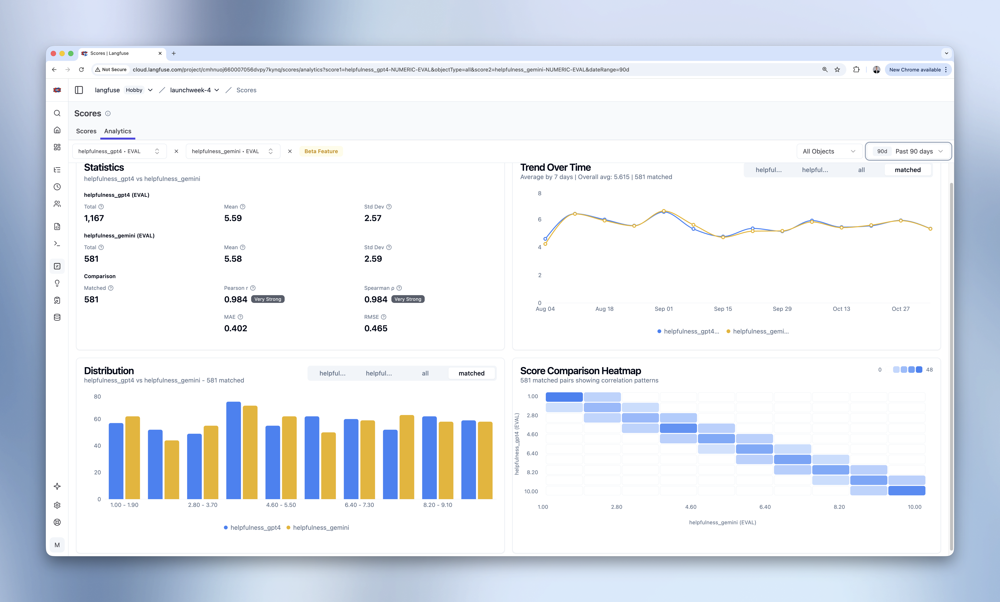

# Evaluate and Score

LLMs are non-deterministic.  When switch out a model, change your prompts, or modify your RAG pipeline, how do you know
if your changes improved the user experience?  This is where Evaluation and Scoring comes in.  Conversations with the
LLM are scored using various scoring strategies.  From those scores you can determine the quality of your AI applications.

Evaluation makes a lot of sense when writing unit and integration tests, that was covered earlier on the [Test](#test) page.
But, evaluation can also be done at runtime or post production to analyze patterns and trends.  Quarkus AI's
integration with [LangFuse](https://langfuse.com) makes it easy to evaluate and score your AI applications.

## Evaluation and LangFuse

LangFuse allows you to define data sets on a set of traces.  From these data sets you can run your dataset through 
two versions of your system, and compare what comes out. The result tells you whether a change actually helped, and by how much.
LangFuse allows you to define and apply different evaluation and scoring strategies to your data sets so you can determine
the quality of your AI applications.

