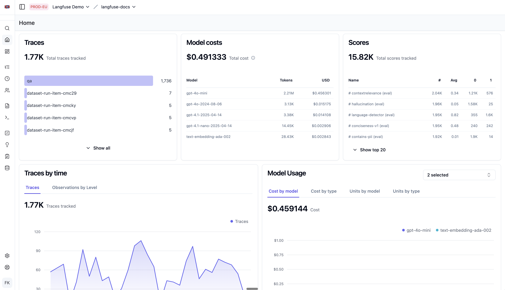

# Monitoring, Tracing, Metrics

Quarkus AI publishes OpenTelemetry metrics and traces that can be consumed by Prometheus or other monitoring systems.
In particular, it has great integration with [LangFuse](https://langfuse.com).  LangFuse monitoring features
allow you to make sense of all your AI telemetry data.

## Tracing

Quarkus AI publishes traces to the OpenTelemetry collector which LangFuse can consume.  You can
view individual conversation traces as your users and agents interact with the LLM.

## Metrics

The telemetry data published also allows LangFuse to provide insight into the performance of your AI model
and application.

